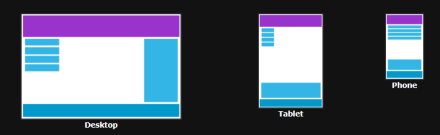
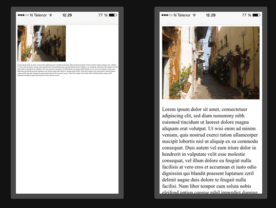

--- 
title: Clase 4 - Maquetacion y Desarrollo Web I 
description-meta: Clase 4
author-meta: Maquetacion y Desarrollo Web I
--- 

# 1. Diseño Responsive
Cuando hablamos de diseño responsive, nos referimos a diseñar nuestras paginas web de tal forma que se vean bien en todos los dispositivos, sin importar el tamaño o disposicion de las pantallas.
El diseño responsive es mas bien una forma de diseñar, no algo que se programa, y se logra mediante nuestro HTML y CSS.

## 1.1 Diseñando la mejor experiencia para todos los usuarios
Nuestras paginas web pueden ser visualizadas de muchas maneras: desde una pc de escritorio, desde una notebook, tablets, telefonos, entre otras, y siempre deberia verse bien y ser facil de usar, sin importar el dispositivo donde se encuentre el usuario. Sin embargo, no debemos dejar fuera informacion con tal de adaptarnos a, por ejemplo, la pantalla mas pequeña de un dispositivo movil, en su lugar lo que debemos hacer es adaptar los contenidos de nuestra pagina para que encajen en cualquier tipo de dispositivo.



Cuando mediante el uso de HTML y CSS logramos que nuestros continedos se escondan, encojan, agranden o muevan con tal de verse bien en todos los dispositivos, entonces logramos tener un diseño web responsive

## 1.2 El Viewport
### 1.2.1 ¿Que es el Viewport?
El Viewport es el area visible para el usuario de una pagina web. Varia segun cada dispositivo, siendo mas pequeño en dispositivos moviles, por ejemplo.
Antes de la proliferacion de los dispositivos moviles, las paginas eran diseñadas pensando unicamente en las pantallas de computadora, siendo comun que tendieran a tener un diseño estatico y un tamaño fijo.
Cuando la navegacion movil empezó a volverse comun, dichas paginas de tamaño fijo se  volvieron demasiado grandes para caber en los viewports. Para solucionar este problema, los navegadores de dichos dispositivos reducian la pagina web entera para que se viera mejor en la pantalla. No era perfecto, pero funciono como solucion rapida.

### 1.2.2 Estableciendo nuestro Viewport
con HTML5 se introdujo un metodo que permitio a los diseñadores web tomar control del viewport medienta la etiqueta `<meta>`
Deberiamos incluirlo en nuestras paginas de la siguiente manera:
```html
<meta name="viewport" content="width=device-width, initial-scale=1.0">
```
Esto le da instrucciones al navegador sobre como controlar las dimensiones y el  escalado de nuestra pagina.
La parte `width=device-width` se encarga de que el ancho de nuestra pagina siga el ancho de la pantalla (que variara segun el dispositivo)
La parte `initial-scale=1.0` establece que el nivel de zoom que tendra la pagina cuando es cargada por el navegador web



**Sin el Viewport en la etiqueta `<meta>`** **/** **Con el Viewport en la etiqueta `<meta>`**

### 1.2.3 Ajustando el tamaño del contenido al Viewport

Los usuarios estan acostumbrados a desplazarse verticalmente tanto en escritorio como en movil, **¡pero no horizontalmente!**
Por lo tanto, si es usario es obligado a desplazarse horizontalmente, o a hacer zoom constantemente para recien ver completa la pagina, esto resulta en una experiencia muy pobre con nuestra pagina.

### 1.2.4 Algunas reglas adicionales para seguir
#### **NO usar elementos grandes con un ancho fijado**
Por ejemplo, si una imagen se muestra con un ancho mas grande que el del Viewport, esto puede provocar que el viewport se mueva horizontalmente. Siempre recorda ajustar el contenido para que entre dentro del ancho del viewport.

#### NO dejar que el contenido recaiga en un viewport en particular para renderizarse
Dado que las dimensiones de la pantalla y anchos de viewport en pixeles varian demsiado entre dispositivos, el renderizado del contenido no deberia recaer **NUNCA** en un viewport puntual.

# 2. Pseudo-classes

Una pseudoclase CSS es una palabra clave que se añade a los selectores y que especifica un estado especial del elemento seleccionado. Por ejemplo, :hover aplicará un estilo cuando el usuario haga hover sobre el elemento especificado por el selector.

```css
div {
  background-color: blue;
}

div:hover {
  background-color: orange;
}
```

<div style=" background-color: blue; color: white; text-align: center; line-height: 100px;" onmouseover="this.style.backgroundColor='orange';" onmouseout="this.style.backgroundColor='blue';">Estilo cuando el usuario haga hover</div>


Otra pseudoclase común es :active, que se aplica cuando el usuario hace clic en un enlace o un elemento activable. Esto permite proporcionar retroalimentación visual en el momento en que se realiza una acción, como cambiar el color de un botón al hacer clic.

Además, las pseudoclases también pueden utilizarse para seleccionar elementos específicos dentro de un contexto particular. Por ejemplo, :first-child selecciona el primer elemento hijo de su padre, lo que permite aplicar estilos únicos a ese elemento. :nth-child(n) permite seleccionar elementos en función de su posición en relación con sus hermanos, lo que proporciona un gran control para la presentación de elementos en una lista.

## 2.1 Sintaxis

Las pseudoclases son precedidas por un dos-puntos (:)
```
selector:pseudoclase { propiedad: valor; }
```
Al igual que las clases, se pueden concatenar la cantidad de pseudoclases que se deseen en un selector.

## 2.2 Pseudoclases mas comunes

| Pseudoclase      | Descripción |
| -------------- | ---------:|
| `:hover`        | Aplica estilos cuando el cursor del mouse está sobre el elemento. |
| `:active`       | Aplica estilos cuando el elemento está siendo activado, como al hacer clic en un enlace. |
| `:focus`        | Aplica estilos cuando el elemento obtiene el foco, como al hacer clic en un campo de entrada. |
| `:nth-child(n)` | Selecciona el elemento que es el enésimo hijo de su padre. |
| `:first-child`  | Selecciona el primer hijo de su padre. |
| `:last-child`   | Selecciona el último hijo de su padre. |
| `:nth-of-type(n)` | Selecciona el enésimo elemento de un tipo específico dentro de su padre. |
| `:first-of-type` | Selecciona el primer elemento de un tipo específico dentro de su padre. |
| `:last-of-type`  | Selecciona el último elemento de un tipo específico dentro de su padre. |
| `:not(selector)` | Selecciona elementos que no coinciden con el selector dado. |
| `:checked`      | Selecciona elementos de entrada (como casillas de verificación) que están marcados. |
| `:disabled`     | Selecciona elementos de entrada deshabilitados. |
| `:enabled`      | Selecciona elementos de entrada habilitados. |
| `:visited`      | Selecciona enlaces que ya han sido visitados. |

## 2.3 En resumen

Las pseudoclases son una herramienta poderosa para agregar interactividad y estilo a las páginas web. Permiten la creación de efectos visuales dinámicos y la adaptación de la presentación de los elementos según el contexto y la interacción del usuario. Sin embargo, es importante usarlas con moderación y seguir buenas prácticas de organización de código para mantener un CSS limpio y fácil de mantener.


# 3. Navegación y menús desplegables

La navegación en el contexto de una página web hace referencia al acceso a diferentes partes de un sitio (o sitios externos) mediante el uso de links (`<a>`). Frecuentemente, se acostumbra a tener componentes de navegación en una página que abarcan la parte superior de la misma (llamadas topbar), otras que abarcan la parte lateral (llamadas sidebar) o incluso elementos en el footer de la pagina que redireccionan a por ejemplo, información de contacto de los creadores/empresa.

La estructura HTML típica de un elemento de navegación es la siguiente:

```html
<nav>
  <a href="/html/">HTML</a> 
  <a href="/css/">CSS</a> 
  <a href="/js/">JavaScript</a> 
</nav>
```

El tag HTML `<nav>` define un conjunto de links de navegación en su interior, mientras que los `<a>` son links hacia otras páginas.

Con esta misma estructura previamente hemos podido realizar un ejemplo de header para una pagina web.
Ahora haremos un menu desplegable con un boton, donde al poner el mouse sobre dicho botón, se nos desplegarán los links disponibles asociados a ese menú.

```html
<div class="dropdown">
  <button class="btn">
	Mi perfil
  </button>
  <div class="dropdown-options">
	<a class="drop-item" href="#">Home</a>
	<a class="drop-item" href="#">Configuracion</a>
	<a class="drop-item" href="#">Salir</a>
  </div>
</div>
```
Las clases CSS necesarias para crear el efecto de despliegue son `dropdown` y `dropdown-options`. El resto son meramente estéticos.

```css
.dropdown {
  position: relative;
}

.dropdown-options {
  display: none;
  position: absolute;
  overflow: none;
}

.dropdown:hover .dropdown-options {
  display: flex;
  flex-direction: column;
}
``` 
La clase`.dropdown-options` que tiene el menu que se va a desplegar, tiene por defecto `display: none` lo que significa que esta oculto. 
Con la ultima regla css lo que decimos es que cuando el `div` que contiene todo sea accionado por un evento `hover` (es decir, que se ponga el mouse encima) entonces el `display` pase a ser `display: flex` y por lo tanto se haga visible. Como detalle lo pusimos como `flex-direction: column` para que se muestren verticalmente.
El “truco” esta en que la clase dropdown que representa al contenedor principal tiene `position: relative` mientras que el contenedor de los links tiene `position: absolute`, por ende cuando se hace un `hover` al botón se muestra el contenido debajo del botón.

El ejemplo completo queda de esta forma:

<p class="codepen" data-height="300" data-theme-id="dark" data-default-tab="html,result" data-slug-hash="MWZWVNJ" data-editable="true" data-user="Ignacio-Martin-Citate-G-mez" style="height: 300px; box-sizing: border-box; display: flex; align-items: center; justify-content: center; border: 2px solid; margin: 1em 0; padding: 1em;">
  <span>See the Pen <a href="https://codepen.io/Ignacio-Martin-Citate-G-mez/pen/MWZWVNJ">
  Untitled</a> by Ignacio Martin Citate Gómez (<a href="https://codepen.io/Ignacio-Martin-Citate-G-mez">@Ignacio-Martin-Citate-G-mez</a>)
  on <a href="https://codepen.io">CodePen</a>.</span>
</p>
<script async src="https://cpwebassets.codepen.io/assets/embed/ei.js"></script>

> Nótese que hay mas clases de css para los estilos como `btn` y `drop-item`, les recomendamos explorarlos y quitarlos para ver su efecto y entender los estilos aplicados.

